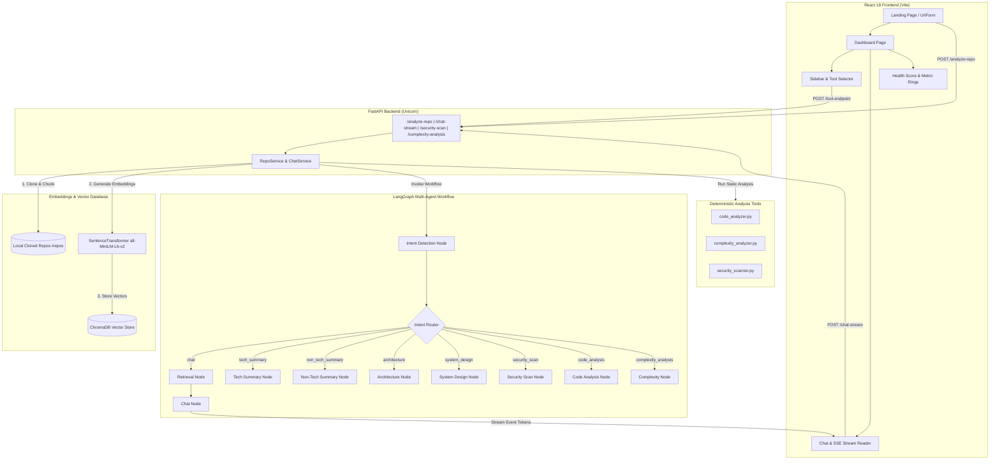

# RepoMind (GitChat) — Exhaustive Technical & Business Reference Script (`script.md`)

This document serves as the complete, authoritative, and exhaustive technical and business logic specification for **RepoMind** (also referred to as **GitChat**). It contains all architectural details, operational workflows, data schemas, mathematical formulas, backend multi-agent logic, static analysis mechanics, frontend component hierarchies, API references, and deployment procedures.

---

## Table of Contents

1. [Executive & Business Overview](#1-executive--business-overview)
   - 1.1 Product Vision & Core Value Proposition
   - 1.2 Target Audience & Key Use Cases
   - 1.3 Feature Matrix & Capabilities
   - 1.4 Strategic Business Impact
2. [High-Level Architecture & Data Flow](#2-high-level-architecture--data-flow)
   - 2.1 System Topology & Mermaid Diagram
   - 2.2 Repository Ingestion & Vector Indexing Pipeline
   - 2.3 LangGraph Multi-Agent RAG & SSE Streaming Pipeline
   - 2.4 Deterministic Static Code Analysis Engine
3. [Backend Technical Deep-Dive](#3-backend-technical-deep-dive)
   - 3.1 Technology Stack & Dependencies
   - 3.2 Environment Configuration & Dynamic Paths (`app/config.py`)
   - 3.3 FastAPI Controller & Router Specifications (`app/main.py`)
   - 3.4 Ingestion Subsystem (`ingestion/`)
   - 3.5 Vector Store & Embedding Layer (`embeddings/`)
   - 3.6 Static Analysis Tools (`tools/`)
   - 3.7 LangGraph Multi-Agent Engine (`agents/`)
   - 3.8 Service Orchestration Layer (`services/`)
4. [Frontend Technical Deep-Dive](#4-frontend-technical-deep-dive)
   - 4.1 Technology Stack & Build Tools
   - 4.2 Application Architecture & View Switching (`App.tsx`)
   - 4.3 Interactive Dashboard & SSE Reader (`Dashboard.tsx`)
   - 4.4 Component Breakdown & UI Design System
   - 4.5 Design Tokens & CSS Architecture (`index.css`)
5. [Mathematical Models & Health Scoring Engine](#5-mathematical-models--health-scoring-engine)
   - 5.1 AST Cyclomatic Complexity & Nesting Penalty
   - 5.2 Halstead Volume & Maintainability Index Formula
   - 5.3 Composite Repository Health Score (0–100)
   - 5.4 Risk Heatmap & Letter Grading Breakdown
6. [API Endpoint Reference & Data Schemas](#6-api-endpoint-reference--data-schemas)
   - 6.1 Full REST API Directory
   - 6.2 Server-Sent Events (SSE) Streaming Format
7. [Deployment, Environment & Operations](#7-deployment-environment--operations)
   - 7.1 Local Development Quickstart
   - 7.2 Docker Containerization (`Dockerfile`)
   - 7.3 Operational Considerations & Known Limitations

---

## 1. Executive & Business Overview

### 1.1 Product Vision & Core Value Proposition
**RepoMind** is an AI-powered code intelligence platform designed to eliminate the steep onboarding curve and context-switching cost of reading unfamiliar codebases. By dropping any public GitHub repository URL into RepoMind, developers, engineering managers, security auditors, and executives gain instant, multi-perspective insights into the software.

Unlike traditional static tools or generic LLM wrapper chats, RepoMind combines **deterministic static code analysis** (AST parsing, security pattern matching, complexity heatmaps) with a **LangGraph multi-agent RAG (Retrieval-Augment Generation)** workflow powered by Groq and Llama 3.1.

### 1.2 Target Audience & Key Use Cases
- **Software Engineers & Developers**: Quickly understand software architecture, find implementation examples, and debug code snippets within a new or legacy repository.
- **Engineering Managers & Tech Leads**: Evaluate repository health, monitor cyclomatic complexity, assess maintainability, and review code quality anti-patterns.
- **Product Managers & Executives**: Generate plain-language, non-technical business summaries detailing key capabilities, target audience, and business value without reading code.
- **Security & Compliance Auditors**: Identify hardcoded API credentials, secrets, unsafe shell executions, and vulnerable third-party dependencies.

### 1.3 Feature Matrix & Capabilities

| Capability | Description | Business Value | Technical Implementation |
|---|---|---|---|
| **Conversational Code RAG Q&A** | Real-time interactive streaming chat over indexed codebase context | Instant developer Q&A, reduced onboarding time | Vector search via ChromaDB + MiniLM + Llama 3.1 streaming |
| **Technical Summary** | Comprehensive developer-oriented narrative of tech stack & modules | Rapid technical onboarding | LangGraph `tech_summary_node` + vector retrieval |
| **Executive (Business) Summary** | Non-technical breakdown of business value & user features | Stakeholder alignment without tech jargon | LangGraph `non_tech_summary_node` with strict jargon filter |
| **Architecture Review** | Module layout, directory hierarchy, and system boundary analysis | Visualizing codebase structure | LangGraph `architecture_node` |
| **System Design Overview** | High-level infra, database schemas, and design pattern analysis | Evaluating system scalability | LangGraph `system_design_node` |
| **Static Security Scan** | Scans for exposed secrets, unsafe functions & bad dependencies | Mitigating security breaches early | Regex scanners for secrets & CVE dependency checks |
| **Code Quality Audit** | Identifies code smells, unused imports, long functions & duplication | Reducing technical debt | AST + Regex pattern matching (`code_analyzer.py`) |
| **Complexity Heatmap & Score** | Computes cyclomatic complexity, maintainability index & 0-100 score | Quantifying codebase technical debt | Python AST `NodeVisitor` + Halstead & Maintainability formulas |

---

## 2. High-Level Architecture & Data Flow

### 2.1 System Topology & Mermaid Diagram



### 2.2 Repository Ingestion & Vector Indexing Pipeline
1. **URL Normalization**: The user inputs a GitHub URL (e.g., `github.com/owner/repo`). `normalize_repo_url()` cleans query params, trailing slashes, and missing protocols.
2. **Repository Hash Identification**: `get_repo_id()` generates an MD5 hash of the normalized URL to serve as a unique, deterministic key (`repo_id`).
3. **Caching Check**: `VectorStore.collection_exists(repo_id)` checks if ChromaDB already contains indexed vectors for this `repo_id`. If indexed, cloning and chunking are skipped.
4. **Shallow Clone**: If not cached, `GitPython` performs a shallow git clone (`depth=1`, `GIT_TERMINAL_PROMPT=0`) into `repos/{repo_id}`.
5. **File Filtering**: `filter_files()` walks the tree, excluding noise (`.git`, `node_modules`, `dist`, `build`, `venv`, `__pycache__`, `assets`, etc.) and matching allowed source extensions (`.py`, `.js`, `.ts`, `.jsx`, `.tsx`, `.java`, `.go`, `.rs`, `.json`, `.sql`, `.dockerfile`, etc.).
6. **Code Chunking**: `chunk_code()` uses LangChain's `RecursiveCharacterTextSplitter` configured with `chunk_size=800` and `chunk_overlap=100` to partition file contents.
7. **Embedding & Storage**: Text chunks are embedded via `SentenceTransformer("all-MiniLM-L6-v2")` and stored in a persistent ChromaDB collection named `repo_{repo_id}`.

### 2.3 LangGraph Multi-Agent RAG & SSE Streaming Pipeline
1. **State Initialization**: An `AgentState` payload containing conversation messages, `repo_url`, `repo_id`, and `analysis_type` is passed to the compiled LangGraph workflow.
2. **Intent Classification**: The `detect_intent` node evaluates the user's message using Llama 3.1 via Groq. If the request explicitly asks for technical summaries, architecture reviews, security scans, or complexity reports, the intent is classified accordingly. Default is `chat`.
3. **Conditional Routing**: The router forwards the state to the designated agent node.
4. **Context Retrieval (for `chat`)**: `retrieval_node` queries ChromaDB for the top 5 most relevant document chunks based on semantic similarity.
5. **Response Generation**: The worker node constructs a specialized prompt containing retrieved code snippets or static scan JSON outputs and invokes Groq Llama 3.1.
6. **SSE Token Streaming**: For `/chat-stream`, `ChatService.stream_chat()` utilizes `workflow.astream_events(state, version="v2")` to filter `on_chat_model_stream` events and yield raw text tokens over a Server-Sent Events HTTP connection.

---

## 3. Backend Technical Deep-Dive

### 3.1 Technology Stack & Dependencies
- **Runtime**: Python 3.10+
- **API Framework**: FastAPI `0.115.0` & Uvicorn `0.30.6`
- **Agent Orchestration**: LangGraph `0.2.28` & LangChain Core `0.3.0`
- **LLM Provider**: `langchain-groq` `0.1.9` (Model: `llama-3.1-8b-instant`)
- **Vector Database**: `chromadb` `0.5.5`
- **Embeddings**: `sentence-transformers` `3.1.1` (Model: `all-MiniLM-L6-v2`)
- **Git Operations**: `GitPython` `3.1.43`
- **Text Processing**: `langchain-text-splitters` `0.3.0`
- **Environment & Config**: `python-dotenv` `1.0.1`, `pydantic` `2.9.2`

### 3.2 Environment Configuration (`backend/app/config.py`)
The `Config` class handles settings and dynamic path fallbacks:
```python
class Config:
    GROQ_API_KEY = os.getenv("GROQ_API_KEY")
    LANGCHAIN_API_KEY = os.getenv("LANGCHAIN_API_KEY")
    LANGCHAIN_TRACING_V2 = os.getenv("LANGCHAIN_TRACING_V2", "false").lower() == "true"
    
    @property
    def CHROMA_DB_DIR(self) -> str:
        # Tries local cwd/chroma_db, falls back to /tmp/chroma_db on permission error
    
    @property
    def REPO_STORAGE_DIR(self) -> str:
        # Tries local cwd/repos, falls back to /tmp/repos on permission error

    EMBEDDING_MODEL_NAME = "all-MiniLM-L6-v2"
    LLM_MODEL_NAME = "llama-3.1-8b-instant"
```

### 3.3 FastAPI Controller (`backend/app/main.py`)
Exposes HTTP POST endpoints and streaming handlers with CORS enabled for all origins (`*`):
- `POST /analyze-repo`: Triggers cloning, filtering, chunking, indexing, and complexity analysis.
- `POST /chat`: Synchronous single-turn Q&A.
- `POST /chat-stream`: Streaming Q&A returning `StreamingResponse(media_type="text/event-stream")`.
- `POST /tech-summary`: Returns technical summary.
- `POST /non-tech-summary`: Returns business summary.
- `POST /architecture`: Returns architecture analysis.
- `POST /system-design`: Returns system design report.
- `POST /security-scan`: Returns security vulnerabilities report.
- `POST /code-analysis`: Returns code quality & bad practices audit.
- `POST /complexity-analysis`: Returns complexity heatmap & metrics.

### 3.4 Ingestion Subsystem (`backend/ingestion/`)
- **`clone_repo.py`**:
  - `normalize_repo_url(url: str)`: Cleans URL scheme and path.
  - `get_repo_id(repo_url: str)`: Computes `hashlib.md5(clean_url.encode()).hexdigest()`.
  - `clone_repository(repo_url: str)`: Executes `git.Repo.clone_from(clean_url, target_dir, depth=1, env={"GIT_TERMINAL_PROMPT": "0"})`.
- **`file_filter.py`**:
  - `IGNORE_DIRS`: Sets containing `.git`, `node_modules`, `dist`, `build`, `venv`, `__pycache__`, `.next`, `vendor`, `assets`, etc.
  - `ALLOWED_EXTENSIONS`: Whitelist of code extensions (`.py`, `.js`, `.ts`, `.jsx`, `.tsx`, `.java`, `.cpp`, `.c`, `.go`, `.rs`, `.json`, `.yaml`, `.md`, `.sql`, `.html`, `.css`, `.sh`, `.dockerfile`, etc.).
  - Filters out minified files (`.min.js`, `.min.css`), source maps (`.map`), and lockfiles (`.lock`).
- **`chunker.py`**:
  - `chunk_code(files, chunk_size=800, chunk_overlap=100)`: Uses `RecursiveCharacterTextSplitter` to generate chunk objects with metadata `{"file_path": rel_path, "chunk_id": i}`.

### 3.5 Vector Store & Embedding Layer (`backend/embeddings/`)
- **`embedder.py`**: Wraps `SentenceTransformer("all-MiniLM-L6-v2")` to produce 384-dimensional vector embeddings.
- **`vector_store.py`**:
  - Encapsulates `chromadb.PersistentClient`.
  - Manages isolated collections named `repo_{repo_id}`.
  - Implements `add_chunks()`, `query(repo_id, query_text, n_results=5)`, `collection_exists()`, and `get_item_count()`.

### 3.6 Static Analysis Tools (`backend/tools/`)

#### A. Complexity Analyzer (`complexity_analyzer.py`)
- Python files are analyzed using Python's native `ast` module.
- `ComplexityVisitor(ast.NodeVisitor)` increments cyclomatic complexity for:
  - Branching statements (`If`, `For`, `While`)
  - Exception handlers (`Try` handlers)
  - Boolean operators (`BoolOp` values - 1)
- Calculates maximum indentation nesting depth per function.
- Generic non-Python files use regex keyword scanning (`if|else|for|while|switch|case|catch`) to estimate cyclomatic complexity.
- Computes Halstead volume and Maintainability Index.
- Calculates an overall composite **Health Score (0-100)** and letter grade (A/B/C/D/F).

#### B. Security Scanner (`security_scanner.py`)
- Scans Python, JS, TS, Env, YAML, and JSON files for regex patterns:
  - **Secrets**: Generic API Keys, AWS Access/Secret Keys, GitHub Tokens, Slack Tokens, Google Cloud Keys, Firebase Keys.
  - **Unsafe Patterns**: `eval()`, `os.system()`, `subprocess.Popen(shell=True)`, `pickle.loads()`, `yaml.load(Loader=yaml.Loader)`, `requests.get(verify=False)`, hardcoded `0.0.0.0` binds.
- Dependencies Scanner: Checks `requirements.txt` and `package.json` against known vulnerable package versions (e.g., Flask <2.3.0, Requests <2.31.0, Lodash <4.17.21, Axios <1.6.0).

#### C. Code Analyzer (`code_analyzer.py`)
- **Unused Imports**: Heuristic tracking of imported module usage counts.
- **Code Smells**: Flags functions longer than 50 lines or functions with more than 5 arguments.
- **Bad Practices**: Flags bare `except:`, `print()` in production, `global` variables, mutable default arguments `def fn(a=[])`, hardcoded paths, `console.log`, `var`, `eval`.
- **Duplicate Code**: Identifies duplicated lines (>20 characters) within files.

### 3.7 LangGraph Multi-Agent Engine (`backend/agents/`)

```
                  ┌────────────────────────┐
                  │  detect_intent Node    │
                  └───────────┬────────────┘
                              │
                    ┌─────────┴─────────┐
                    │ Intent Router     │
                    └─────────┬─────────┘
      ┌───────────┬───────────┼───────────┬───────────┐
      ▼           ▼           ▼           ▼           ▼
  [retrieve] [tech_sum]   [biz_sum]   [arch_node] [sec_node] ...
      │
      ▼
   [chat]
      │
      └───────────┴───────────┬───────────┴───────────┘
                              ▼
                           [ END ]
```

- **`AgentState` Structure**:
  ```python
  class AgentState(TypedDict):
      messages: Annotated[Sequence[BaseMessage], operator.add]
      repo_url: str
      repo_id: str
      retrieved_chunks: List[str]
      intent: str
      response: str
      analysis_type: str
  ```
- **Specialized Worker Nodes**:
  - `intent_detection_node`: Uses LLM to classify user prompt into 8 intent categories.
  - `retrieval_node`: Fetches vector documents from ChromaDB.
  - `chat_node`: Synthesizes code context with LLM general programming knowledge.
  - `tech_summary_node`: Produces technical narrative of codebase modules and tech stack.
  - `non_tech_summary_node`: Produces executive summary tailored for non-technical stakeholders (strictly forbidding jargon).
  - `architecture_node`: Analyzes directory hierarchy and project organization.
  - `system_design_node`: Evaluates design patterns, infrastructure, and schemas.
  - `security_scan_node`: Formats security scan results into structured Markdown tables.
  - `code_analysis_node`: Formats code quality audit into Markdown tables with refactoring suggestions.
  - `complexity_analysis_node`: Formats AST complexity scores, risk heatmap, and top complex functions.

### 3.8 Service Orchestration Layer (`backend/services/`)
- **`RepoService`**: Manages the end-to-end repository pipeline (`clone` -> `filter` -> `chunk` -> `vector store` -> `complexity scan`).
- **`ChatService`**: Instantiates and executes the LangGraph workflow, supporting both standard invocation (`ainvoke`) and event streaming (`astream_events`).

---

## 4. Frontend Technical Deep-Dive

### 4.1 Technology Stack & Build Tools
- **Framework**: React 18 (`react`, `react-dom`)
- **Language**: TypeScript 5.5
- **Build Tool**: Vite 5.4
- **HTTP Client**: Axios 1.7
- **Markdown Rendering**: `react-markdown` 9.0 with `remark-gfm` 4.0
- **Syntax Highlighting**: `react-syntax-highlighter` 15.5
- **Styling**: Custom CSS Token Architecture (`index.css`, `App.css`)

### 4.2 Application Architecture (`frontend/src/App.tsx`)
`App.tsx` serves as the root container managing state:
- `analyzedRepo`: Stores current active repository URL. `null` displays `LandingPage`; a populated string displays `Dashboard`.
- `complexityData`: Holds initial complexity metrics returned from `/analyze-repo`.
- `isLoading`: Tracks repository ingestion loading state.
- `error`: Displays floating error banner with dismiss capability.

### 4.3 Interactive Dashboard & SSE Reader (`frontend/src/pages/Dashboard.tsx`)
- **Two-Column Responsive Grid**: Fixed sidebar (`280px`) on desktop, collapsible slide-over menu on mobile (`<1024px`).
- **Streaming Handler**: Uses native `fetch` with `ReadableStream` and `TextDecoder` to process token chunks from `/chat-stream` in real-time.
- **Analysis Trigger Handler**: Invokes specific repo tools (`tech`, `business`, `arch`, `design`, `security`, `code`, `complexity-analysis`) and appends responses to the conversation feed.

### 4.4 Component Hierarchy & UI Design System

```
App
 ├── LandingPage
 │    ├── UrlForm (GitHub URL input validation & submission)
 │    ├── LoadingState (Animated progress overlay)
 │    └── StatCards (Repository metrics highlights)
 └── Dashboard
      ├── Sidebar
      │    ├── HealthBreakup (Collapsible Health score breakdown)
      │    │    ├── HealthRing (SVG circular gauge indicator)
      │    │    └── MetricBar (Linear percentage bar)
      │    └── Tool Buttons (Technical, Executive, Security, Complexity, etc.)
      ├── MobileHeader (Hamburger drawer toggle)
      ├── Chat Area
      │    ├── EmptyState (Quick action cards & suggested queries)
      │    └── ChatMessage (React Markdown + GFM + Copy Code Snippet button)
      └── ChatInput (Autosize textarea + Send button)
```

### 4.5 Design Tokens & CSS Architecture (`frontend/src/index.css`)
RepoMind enforces a modern glassmorphism dark aesthetic:
- **Color System**:
  - Base Background: `--bg-base` (`#090d16`)
  - Surface Background: `--bg-surface` (`#0f172a`)
  - Card Background: `--bg-card` (`#1e293b`)
  - Primary Accent: `--color-primary` (`#6366f1` - Indigo)
  - Success: `--color-success` (`#10b981` - Emerald)
  - Warning: `--color-warning` (`#f59e0b` - Amber)
  - Danger: `--color-danger` (`#ef4444` - Rose)
- **Typography**: Google Fonts Inter for UI, Fira Code for code blocks.
- **Effects**: Backdrop blur glassmorphism (`backdrop-filter: blur(12px)`), animated background mesh gradients, smooth transition curves.

---

## 5. Mathematical Models & Health Scoring Engine

The codebase health engine evaluates source code using deterministic static analysis formulas.

### 5.1 AST Cyclomatic Complexity & Nesting Penalty
For Python functions, AST nodes are analyzed:
$$\text{Cyclomatic Complexity } (M) = 1 + \sum \text{Branch Nodes}$$
where Branch Nodes include `If`, `For`, `While`, `Try` handlers, and `BoolOp` terms.

The function complexity incorporates a nesting penalty:
$$\text{Adjusted Function Complexity} = M + (\text{Max Nesting Depth} \times 2)$$

### 5.2 Halstead Volume & Maintainability Index Formula
- **Operators ($N_1$)**: Total count of mathematical and logical operator tokens (`+`, `-`, `*`, `/`, `=`, `<`, `>`, `!`, `&`, `|`).
- **Operands ($N_2$)**: Total count of operand/variable tokens.
- **Halstead Estimate ($H$)**: $H = N_1 + N_2$

The **Maintainability Index (MI)** is calculated using the standard IEEE formula variant:
$$\text{MI} = \max\left(0, \left\lfloor 171 - 5.2 \ln(\max(1, H)) - 0.23 \times M_{\text{avg}} - 16.2 \ln(\max(1, \text{LOC})) \right\rfloor\right)$$

### 5.3 Composite Repository Health Score Formula (0–100)
The overall repository score combines cyclomatic complexity, maintainability, and code density:

$$\text{Complexity Penalty} = \min(100, M_{\text{avg}} \times 5) \times 0.4 + (100 - \text{MI}) \times 0.4 + \min\left(100, \frac{\text{LOC}_{\text{avg}}}{10}\right) \times 0.2$$

$$\text{Health Score} = \max(0, \min(100, \lfloor 100 - \text{Complexity Penalty} \rfloor))$$

### 5.4 Risk Heatmap & Grading Thresholds

| Health Score Range | Grade | Risk Level | Interpretation |
|---|---|---|---|
| **80 – 100** | **A** | **Low** | Excellent quality, minimal technical debt, high maintainability |
| **60 – 79** | **B** | **Low** | Good quality, minor complexity bottlenecks |
| **40 – 59** | **C** | **Moderate** | Moderate complexity, elevated nesting or large functions |
| **20 – 39** | **D** | **High** | High complexity, low maintainability, significant refactoring required |
| **0 – 19** | **F** | **High** | Critical code smells, deep nesting, urgent architectural rewrite needed |

---

## 6. API Endpoint Reference & Data Schemas

### 6.1 Full REST API Directory

#### 1. Repository Ingestion & Analysis
- **`POST /analyze-repo`**
  - **Request Payload**: `{"repo_url": "https://github.com/owner/repository"}`
  - **Response Payload**:
    ```json
    {
      "status": "success",
      "data": {
        "repo_id": "13d8def769052a7dc6ba54b2a8375a1b",
        "file_count": 42,
        "chunk_count": 185,
        "complexity": {
          "final_score": 85,
          "grade": "A",
          "risk_level": "Low",
          "confidence": 100,
          "metrics": {
            "avg_loc": 64,
            "avg_cyclomatic": 2.4,
            "maintainability": 78
          },
          "heatmap": [...],
          "top_functions": [...]
        }
      }
    }
    ```

#### 2. Streaming Q&A
- **`POST /chat-stream`**
  - **Request Payload**: `{"repo_url": "https://github.com/owner/repository", "message": "How does authentication work?"}`
  - **Response Headers**: `Content-Type: text/event-stream`, `Cache-Control: no-cache`
  - **Data Stream**: Raw text tokens emitted sequentially.

#### 3. Analytical Endpoints
- **`POST /tech-summary`**: Returns `{ "status": "success", "summary": "..." }`
- **`POST /non-tech-summary`**: Returns `{ "status": "success", "summary": "..." }`
- **`POST /architecture`**: Returns `{ "status": "success", "architecture": "..." }`
- **`POST /system-design`**: Returns `{ "status": "success", "system_design": "..." }`
- **`POST /security-scan`**: Returns `{ "status": "success", "security_scan": "..." }`
- **`POST /code-analysis`**: Returns `{ "status": "success", "code_analysis": "..." }`
- **`POST /complexity-analysis`**: Returns `{ "status": "success", "complexity_analysis": "..." }`

---

## 7. Deployment, Environment & Operations

### 7.1 Local Development Quickstart

#### Prerequisites
- Python 3.10+
- Node.js 18+ & npm 9+
- Groq API Key

#### Backend Setup
```bash
cd backend
python -m venv env
source env/bin/activate    # On Windows: env\Scripts\activate
pip install -r requirements.txt

# Create .env in root directory
echo "GROQ_API_KEY=your_groq_api_key_here" > ../.env

# Start FastAPI Uvicorn Server
python -m uvicorn app.main:app --reload --host 0.0.0.0 --port 8000
```

#### Frontend Setup
```bash
cd frontend
npm install
npm run dev
```

### 7.2 Docker Containerization (`Dockerfile`)
The repository includes a production-ready container definition:
```dockerfile
FROM python:3.10-slim

WORKDIR /app

RUN apt-get update && apt-get install -y \
    git \
    build-essential \
    curl \
    && rm -rf /var/lib/apt/lists/*

COPY backend/requirements.txt .
RUN pip install --no-cache-dir -r requirements.txt

COPY backend/ .

EXPOSE 8000

CMD ["uvicorn", "app.main:app", "--host", "0.0.0.0", "--port", "8000"]
```

### 7.3 Operational Considerations & Known Limitations
- **Public Repositories**: Current ingestion operates via public git HTTPS URLs.
- **Local Persistence**: Vector embeddings persist in `backend/chroma_db/`. Deleting this folder resets cached indexes.
- **Rate Limits**: LLM processing is bound by Groq API key rate limits for `llama-3.1-8b-instant`.
- **Parsing Scope**: Python uses full AST parsing (`ast.parse`); JS/TS, Java, Go, Rust use regex keyword density heuristics.

---
*End of `script.md` reference specification.*
